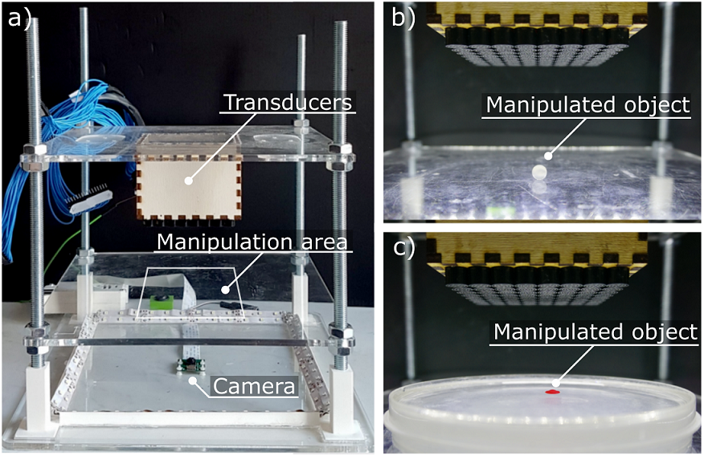

# AcouMan - a platform for acoustic manipulation

AcouMan is a platform for acoustic manipulation, that is for manipulating objects via shaping the surrounding acoustic pressure field. You can see the platform in the figure below and a detailed description will be (hopefully) published soon. If you want to see the platform in action, check our [video](https://youtu.be/Ntwl7yTYtKg) showing some experiments with the platform.

This repository contains all files needed to reproduce the platform.