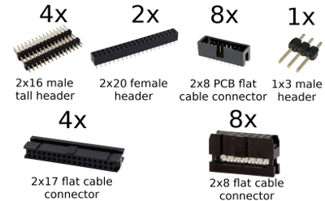
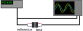
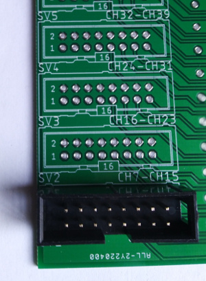
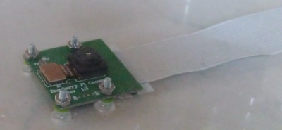
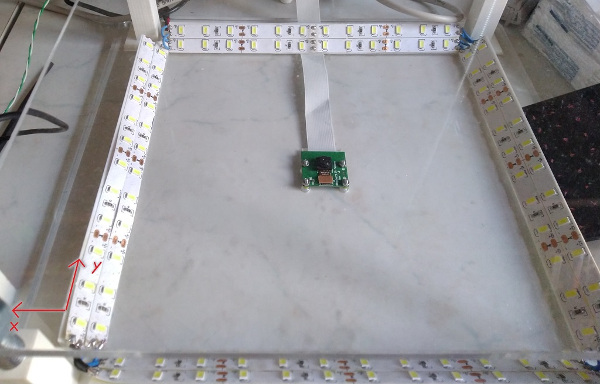
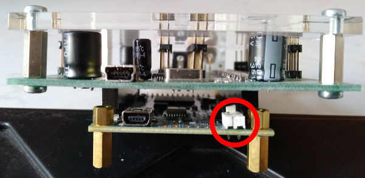
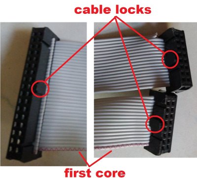

# Building the platform

[index](../README.md) > [assembly](assembly.md)

This documents describes what [components](#required-components) you need and how to [assemble](#assembly) them. Once you finish mechanical assembly, check the guide on [software](software.md).

## Required components

All source files required for building the platform are located in the _manufacturing_ folder.

### Laser-cut components

The drawings are located in _manufacturing/laser cut_ folder in DXF format, and can be opened, for instance, with LibreCAD. Set the units to millimeters. The drawings are split into layers named _Cut_ and _Engrave_ (or, in complicated cases _EngraveTop_ and _EngraveBottom_). Shapes in _Engrave_ layers should be filled (you need to engrave the whole shape, not just its outline).

You need to laser cut the following drawings: _top_, _middle_ and _bottom panel_, and _small transducer box_. The panels must be made from transparent and sturdy material, we recommend using 5mm thick plexiglass. The features engraved in the _bottom panel_ need to be about 1.5-2 mm deep. The _small transducer box_ is designed to be cut from 4mm thick material, we recommend using plywood.

Optionally, you can cut-out the _shield_ from plexiglass.

### 3D printed components

The models are located in _manufacturing/3D print_ in SCAD format. You need to print four copies of models named _pillar_ and _prism_. We recommend printing from PLA on fast or better quality. Optionally, you can also print four protective _caps_ from a soft, flexible material like PLA FLEX or TPU.

### PCB

The PCBs are created in Eagle and use custom libraries, located in the project folder. You need two PCBs, _shield_ and _small transducer board_. All PCB components are listed in the bill of material (BOM - for [shield](../manufacturing/PCB/Shield/BOM.html) and [transducer board](../manufacturing/PCB/TransducerBoard/BOM.html)). In addition, you will also need 34 core flat cable and connectors, that mate with the pin headers on the PCBs.

Description of all necessary signal connectors and their illustration photos are shown in the picture below. ___NOTE:___ _Since we were unable to find 32 core flat cable with connectors, we are using 34 core cable with 2x17 connectors_

### Additional hardware

Apart from the aforementioned components, you will also need:

 * Raspberry Pi model B or B+
 * Raspberry Pi camera module v1.3
 * Terasic DE0 Nano
 * Power supply capable of providing 16V-18V @ 1A
 * 2 meters (8x25 cm segments) of LED stripes and a source to power them
 * 1.2 meters (4x30 cm segments) of M10 threaded rod
 * 8x M10 nuts
 * 4x M2 screws and nuts
 * if you decided to cut-out the plexiglass shield, you will also need 8x M3 screws and 4x M3x12 spacers (both sides female)

## Assembly

### Determine the polarity of transducers

To do this, you will need a function generator and a two-channel oscilloscope. Set the function generator to 40 kHz 5 Vpp sine wave, and connect its output to one transducer (we will call it the reference transducer) and to the first channel of the oscilloscope. Then, connect another transducer (we will call it the test transducer) to the second channel of the oscilloscope and bring the two transducers close.

On the oscilloscope, you should see a sine wave that is (almost) in phase, or out of phase with the signal coming from the generator (see image below). Based on the measurement, mark the contact on the test transducer, which is connected either to the probe live or ground. Repeat the process for all 64 transducers.

### Assemble the transducer box

 1. Align the top of the laser-cut transducer box with the transducer board PCB (as shown in image below). 
 
 2. Slide the transducers into the engraved slots (mind the polarity) and solder them to the PCB.
 3. Solder the 2x8 flat cable connectors. The orientation of the connectors is shown in the image below.
 
 4. Take the remaining parts of the transducer box, put glue on the finger joints, and assemble the box.

### Assemble the platform

#### Start with the bottom panel.
 1. Slide four M2 screws through the laser-cut holes in the center from below, slide the camera module on the screws and fasten it in place with the nuts. 
 
 2. Use an M10 screw tap to drill thread in the 3D printed pillars.
 3. Attach the pillars and prisms to the engraved slots of the bottom panel with glue. Do not use hot glue, it doesn't stick to plexi, use special glue for plastics. The ribbon cable of the camera module must lead under one of the prisms.
 4. Create a chain of LED stripe segments by soldering wires to their contacts (use about 2 - 3 cm long wires) with one end connected to the LED power supply.
 5. Glue the LED stripes to the prisms, you should be able to fit two segments on each.

#### Now, we can add the middle panel.
 1. Screw one M10 nut on each of the four threaded rods, about 10 cm in.
 2. Screw the threaded rods into the pillars (as far as they will go). You could do steps 1 and 2 the other way around, but this will save you some tedious screwing.
 3. Slide on the middle panel. The panel should be oriented so, that if the ribbon cable of the camera is pointing upwards, the _x,y_ axis description should be in the bottom left corner (see the picture below). 
 
 4. Using a tape measure and spirit level, adjust the nuts, so that the middle panel sits about 8 cm above the bottom panel and is level.
 5. Screw in four more nuts to fixate the middle panel both from top and bottom.

#### Finally, we can put together the top panel and complete the platform.
 1. Slide the finger joints of the transducer box into the top panel and glue both parts together.
 2. Screw in four more nuts, this time about 15 cm above the middle panel.
 3. Slide on the top panel with transducers. The PCB connectors should point in the same direction as the ribbon cable of the camera.
 4. Adjust the nuts, so that the distance between the middle panel and the transducers is 65 mm.
 5. Screw in four more nuts to fixate the top panel both from top and bottom.

### Build the shield

#### Program the FPGA

Before building the shield, you need to change the programming of the DE0-Nano board. The Quartus project is located in the _FPGA generator_ folder. For information on how to program the permanent memory of the device, please refer to the user manual available on [Terasic website](https://www.terasic.com.tw/cgi-bin/page/archive.pl?Language=English&CategoryNo=139&No=593&PartNo=4), chapter 9.1.

#### Solder the shield PCB

This is relatively straightforward, but time consuming. Make sure to solder all ICs the correct way. If you have the laser-cut plexiglass shield, you can mount it on top of the PCB using the M3 screws and spacers.

#### Connect the shield with the FPGA

You must remove the plexiglass from the FPGA board in order to connect the boards. You may also have to unsolder/cut off this two-pin header from the FPGA.

Now, just slide the two boards into each other, but mind the orientation. The silkscreens of both boards should be oriented the same way. Also, the miniUSB connectors on both boards should be on the same side.

### Cables and testing

As mentioned above, we use 34 core flat cable. On one end of the cable, we have a 2x17 connector. The other end is split into 16, 16 and 2 unused cores with two 2x8 connectors. Make four cable with the connectors, as shown in the picture below.

If you want to check, that your assembled generator is working, you can run the _generatorCommDemo.py_ script located in _simulink/system object/newGenerator/_. Just connect both miniUSB cables to your PC and change the default 'COM5' port in the script for the port of the USB-UART converter found in the device manager. On pressing Enter, the script should individually turn on all channels.