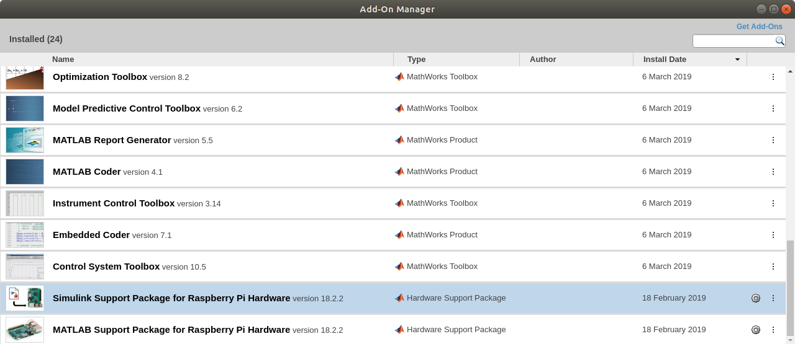
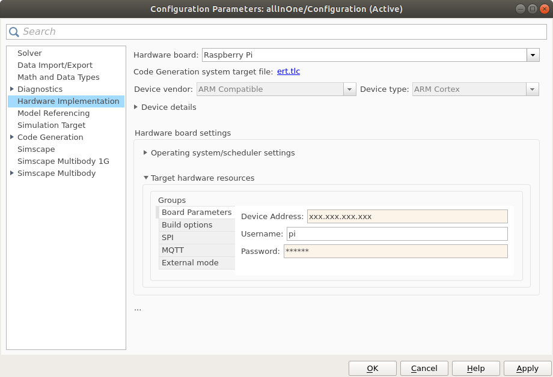
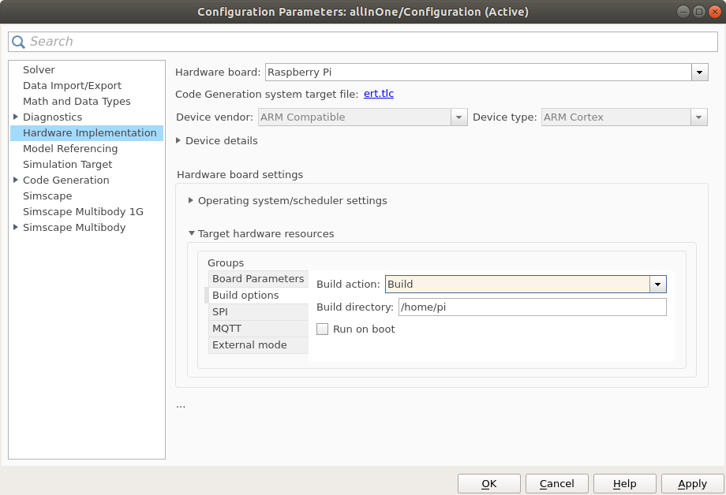

# Building the platform - software
[index](../README.md) > [software](software.md)

For rapid prototyping, we use the following strategy:
We create our control scheme in MATLAB/Simulink and then deploy it to the Raspberry Pi.
The Raspberry then runs the control algorithm, which accepts the reference setpoints remotely via UDP.
This allows us to control the platform from a simple web interface.

## Configuring your PC

### Requirements

In order to deploy the controller to Raspberry Pi, you will need MATLAB & Simulink R2018b or newer _(note: we use this version of MATLAB, because it supports Raspberry Pi 3B+)_ with the following toolboxes/packages:
 * Simulink coder
 * Control systems toolbox
 * Simulink support package for Raspberry Pi

Also, your computer must have an SD card reader.

### Starting the Simulink models

If you change your working directory to _simulink_ and open any of the models, the startup functions should automatically add all necessary folders to MATLAB path.
If you encounter an error, try to run the scripts `BOD_startup` and `BOW_startup` manually.

## Configure the Raspberry Pi

### Install Raspbian with MATLAB server

Insert an empty microSD card in your computer.
In MATLAB, go to the _HOME_ card and select _Add-Ons-\>Manage Add-Ons_.
An Add-On Manager window should appear.



Find the Simulink Support Package and click on the Setup button (the gear).
Follow the guide and install the Raspbian image.

### Copy necessary files

From this repository, you will only need folders `raspi-ballpos` and `webinterface`.
On UNIX systems, use the following command to copy them from your computer:
```
scp -r raspi-ballpos/ webinterface/ pi@xxx.xxx.xxx.xxx:~
```

### Enable Camera

Either directly in the Raspberry Pi terminal, or remotely via SSH, type:
```
sudo raspi-config
```
and select the `Enable Camera` option.

### Install dependencies

#### OpenCV

Follow [this guide](https://www.pyimagesearch.com/2016/04/18/install-guide-raspberry-pi-3-raspbian-jessie-opencv-3/) on installing OpenCV on Raspbian Jessie.
_Note: The installation is quite lenghty. If you do it remotely, we recommend using `screen`, so you can disconnect without interrupting the process_

#### C++ libraries

Download [Eigen](http://eigen.tuxfamily.org/) and [LBFGS++](http://yixuan.cos.name/LBFGSpp/) libraries, and copy them to `/usr/include/`.

#### Python modules

Install the following modules using `pip`:
``` 
sudo pip3 install picamera click flask flask_socketio matplotlib profilehooks RPi.GPIO screeninfo imutils eventlet requests scipy
```
In addition, it may be necessary to upgrade the numpy module provided during OpenCV installation:
```
sudo pip3 install numpy --upgrade
```
Also, there are two custom packages in the `raspi-ballpos` folder that must be installed:
```
cd raspi-ballpos
cd sharemem/
sudo ./install
cd ../find_object/
sudo ./install
```

### Services

Copy all service files from `webinterface`:
```
sudo cp ~/webinterface/*.service /lib/systemd/system/
```
Enable the services at startup:
```
sudo systemctl enable posmeas.service 
sudo systemctl enable ultraman.service
sudo systemctl enable ultraman_web.service
```

### Configuration files

Move the configuration files from `webinterface` to user folder:
```
mv ~/webinterface/*.json ~/
```

## Deploy the controller

Open the Simulink model `simulink/allInOne.slx`.
Go to the _Model Parameters_ (the gear icon) and select _Hardware Implementation_.
Set _Hardware Board_ to Raspberry Pi, expand the _Target Hardware Resources_ tab and fill in the _Board Parameters_, as shown in the picture.



Go to the _Build Options_ group and select _Build_ as the _Build Action_. Set the _Build Directory_ to `/home/pi`.



Apply the changes and exit the _Model Parameters_ window.

Now, you can click on the _Deploy to Hardware_ button (the serial port icon).
If you cannot see the button, change the _Simulation Mode_ to _External_.

Since the R2018b version, MATLAB doesn't create the deployed model in the user folder.
You need to copy the controller:
```
cp ~/MATLAB_ws/R2018b/path_to_repository/simulink/allInOne.elf ~
```

## Controlling the platform

Now, you should be able to control the platform from the web interface.
Start the services so you don't need to restart the Raspberry.
```
sudo systemctl start posmeas.service 
sudo systemctl start ultraman.service
sudo systemctl start ultraman_web.service
```

On your computer, open a web browser.
The web interface should be accessible from port 5000 (`xxx.xxx.xxx.xxx:5000`).